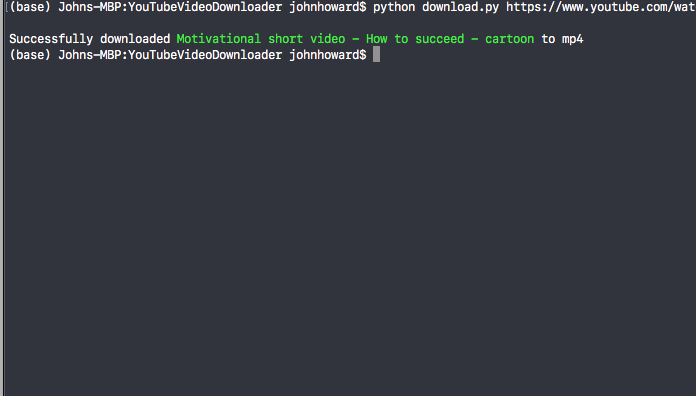
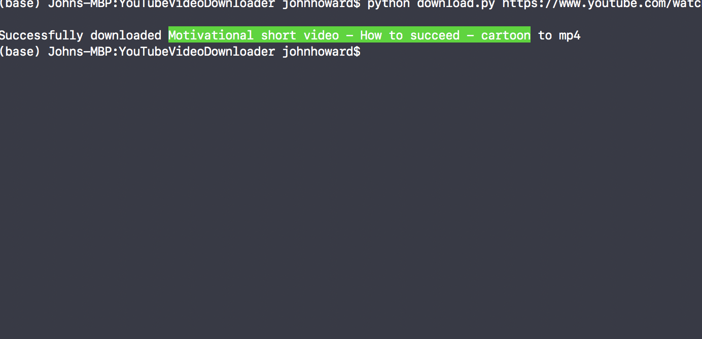
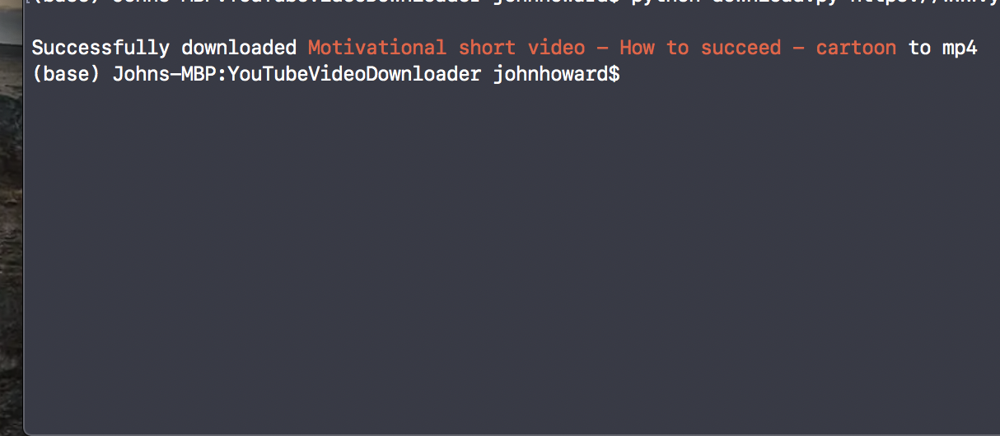

# Как печатать цветной текст в Python

При печати вывода программы Python на терминал чтение может быть проще, если мы изменим цвет определенных частей строки. Мы можем подойти к этому по-разному и использовать пакеты, чтобы упростить процесс, что мы и изучим в этом руководстве.


## Использование управляющих последовательностей ANSI

Самый простой способ напечатать цветной текст из программы на Python — использовать escape-последовательности ANSI. Для этого мы создадим класс, содержащий свойства для применения различных цветов к тексту. Давайте создадим файл с именем *colors.py*, содержащий класс цветов, импортируем его в программу, а затем используем в строке f.

``` python
class bcolors:
    HEADER = '\033[95m'
    OKBLUE = '\033[94m'
    OKGREEN = '\033[90m'
    WARNING = '\033[93m'
    FAIL = '\033[91m'
    ENDC = '\033[0m'
    BOLD = '\033[1m'
    UNDERLINE = '\033[4m'
```
``` python
from colors import bcolors
```
``` python
return f'Successfully downloaded {bcolors.OKGREEN}{file.title}{bcolors.ENDC} to {formt}'
```

Цвет текста изменяется между bcolors.OKGREENи bcolors.ENDC:



Как мы видим, каждая управляющая последовательность символов ANSI имеет вид \033[XXXm. Часть после [(квадратной скобки) — это стиль текста. Числа 90-96обеспечивают диапазон различных цветов текста. Вот какие они:


|Число|Цвет|
|-----|----|
|90| <span style="color:grey">серый</span>|
|91| <span style="color:red">красный</span>|
|92| <span style="color:green">зеленый</span>|
|93| <span style="color:yellow">желтый</span>|
|94| <span style="color:blue">синий</span>|
|95| <span style="color:pink">розовый</span>|
|96| <span style="color:turquoise">бирюзовый</span>|

Лично мне нравится этот подход, потому что вы можете определить любой эффект шрифта в классе, а затем использовать его в своей программе.


## Изменение цвета фона текста

Чтобы изменить цвет фона текста, мы можем использовать номера символов управляющей последовательности ANSI 100-107. Давайте расширим bcolorsтолько что созданный класс, включив в него фоновые цвета.

``` python
class bcolors:
    HEADER = '\033[95m'
    OKBLUE = '\033[94m'
    OKGREEN = '\033[92m'
    WARNING = '\033[93m'
    FAIL = '\033[91m'
    ENDC = '\033[0m'
    BOLD = '\033[1m'
    UNDERLINE = '\033[4m'
    # Background colors:
    GREYBG = '\033[100m'
    REDBG = '\033[101m'
    GREENBG = '\033[102m'
    YELLOWBG = '\033[103m'
    BLUEBG = '\033[104m'
    PINKBG = '\033[105m'
    CYANBG = '\033[106m'
```
``` python
from colors import bcolors
```
``` python
return f'Successfully downloaded {bcolors.GREENBG}{file.title}{bcolors.ENDC} to {formt}'
```




Вот все доступные цвета фона и соответствующие им номера ANSI:

|Число|	Цвет|
|-----|-----|
|100|<span style="color:grey">серый</span>|
|101|<span style="color:red">красный</span>|
|102|<span style="color:green">зеленый</span>|
|103|<span style="color:yellow">желтый</span>|
|104|<span style="color:blue">синий</span>|
|105|<span style="color:pink">розовый</span>|
|106|<span style="color:turquoise">бирюзовый</span>|

## Все доступные эффекты шрифта
Для справки здесь приведены все доступные коды эффектов шрифта для изменения стиля текста в терминале:


|Номер(а)|Эффект|
|--------|--------|
|0	|Сброс / Обычный
|1	|Жирный или повышенной интенсивности
|2	|Слабый (сниженной интенсивности)
|3	|Курсив
|4	|Подчеркнуть
|5	|Медленное мигание
|6	|Быстрое мигание
|7	|[[обратное видео]]
|8	|Скрыть
|9	|Перечеркнутый
|10	|Основной (по умолчанию) шрифт
|11–19	|Альтернативный шрифт
|20	|Фрактур
|21	|Жирный или двойное подчеркивание
|22	|Нормальный цвет или интенсивность
|23	|Не курсив, не Fraktur
|24	|Подчеркивание выключено
|25	|Моргнуть
|27	|Инверсное выкл.
|28	|Показывать
|29	|Не зачеркнуто
|30–37|Установить цвет переднего плана
|38	|Установить цвет переднего плана
|39	|Цвет переднего плана по умолчанию
|40–47|	Установить цвет фона
|48	|Установить цвет фона
|49	|Цвет фона по умолчанию
|51	|В рамке
|52	|Окруженный
|53	|Подчеркнуто
|54	|Не обрамлено и не окружено
|55	|Не зачеркнуто
|60	|идеограмма подчеркивание
|61	|идеограмма двойное подчеркивание
|62	|идеограмма
|63	|идеограмма с двойной чертой
|64	|ударение идеограммой
|65	|атрибуты идеограммы выключены
|90–97	|Установите яркий цвет переднего плана
|100–107	|Установите яркий цвет фона


## Пакет «Колорама»
Если вы предпочитаете использовать пакет для изменения цветов печати в Python, установите coloramaпакет. Чтобы установить его, введите в терминал следующее:


``` python
pip install colorama
```

Затем импортируйте классы переднего плана, фона и стиля в вашу программу:


``` python
from colorama import Fore, Back, Style
```

Чтобы изменить часть текста на красный, используйте Fore.REDи , чтобы вернуть остальной текст к обычному использованию.Style.RESET_ALL

``` python
return f'Successfully downloaded {Fore.RED}{file.title}{Style.RESET_ALL} to {formt}'
```


Вот все форматтеры, доступные в colorama:


- Fore - BLACK, RED, GREEN, YELLOW, BLUE, MAGENTA, CYAN, WHITE, RESET.
- Back - BLACK, RED, GREEN, YELLOW, BLUE, MAGENTA, CYAN, WHITE, RESET.
- Style - DIM, NORMAL, BRIGHT, RESET_ALL


## Вывод
Теперь вы знаете, как стилизовать цветной текст для печати в Python.
